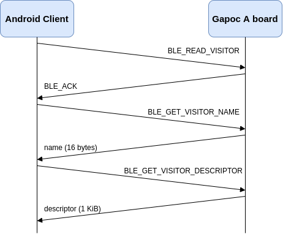
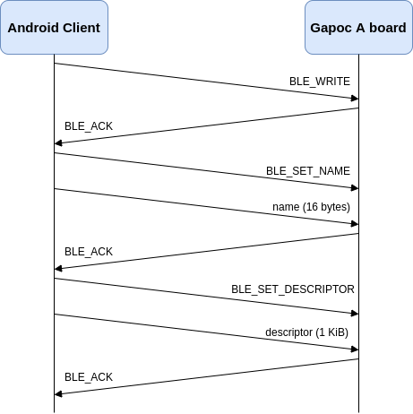

# Overview

Gapoc A board includes Bluetooth LE module that allows smart door bell management with Android-based smartphone remotely. During regular re-id loop the demo stores all stranger's descriptors and photos in L2 and L3 memory accordingly. On button press the board is switched to the visitors management mode and activates Bluetooth module for smartphone connection. The visitors management consists of three phases: strangers information download to the phone, users management on phone and approved users upload back to device memory. Strangers download to phone and further upload to the device is covered in dedicated sections bellow. At the end of visitors administration step all strangers are dropped from L2 and L3 memory as all known people has been already added to the list of users.

# Strangers Download to Android App


# Visitors Download to Android App



# Known Users Database Update



# Administration Mode Test

Pre-built Android application package: [link](https://reid-artifacts.s3.eu-central-1.amazonaws.com/FaceID/ReID-Control-App.apk)

The demo repository includes simple administration mode test in `tests/ble_test` folder. The test application for Gapoc A board loads photos and descriptors for Lena and Francesco from host to strangers list and invokes full users administration pipeline on push button press. Please do the following steps:

0. Install and run GAP ReID Control app on you Android Phone.
1. Go to the test app folder and run it with the following command:
```
    $ cd tests/ble_test
    $ make run
```
2. Wait for a `Waiting for button press event` message in console output. It means that the application is ready to handle events.
3. Press the push button on your board and wait for a `AT Config Done` message in console.
4. Press "SCAN" button in the Android app and wait a bit while Bluetooth devices are enumerated.
5. Tap on "GreenWaves-GAPOC" device in the list and wait for the device connection. Please press "Connect" button in the device screen if your device is opened in "Disconnected" state.
6. Press "Refresh" button in the Android app and wait for photos download. You should get 2 people in strangers list: male and female.
7. Tap on the first user. In the new window enter a name and grant an access to "GreenWaves-GAPOC" device. Press "Save" button.
8. Drop the other user.
9. Press push button on the board to exit from users administration mode. The test dumps all new permitted visitor's descriptors to host with user name in file name.
10. Compare dumped descriptor with original one using `cmp` command to ensure that it was transferred correctly:
```
    $ cmp -l ./Francesco.bin <dumped file>.bin # for Francesco
    $ cmp -l ./Lena.bin <dumped file>.bin # for Lena
```

# Known Issues and Hardware Limitations

1. Due to hardware bug in GAP8 chip Hyperram and UART cannot be used in the same time. Demo downloads stranger's photos to L2 memory and switch `HYPERBUS_DATA6_PAD` mode to UART mode before Bluetooth module enabling and back after the disconnect.

2. GAP8 chip does not support hardware flow control and interacts with U-blox's NINA BLE module using DMA ignoring it's state. Maximum DMA transfer size is 1 KiB. In case if sent or received buffer is larger than the maximum transfer size several DMA calls are done without BLE module await that leads to data corruption. The demo splits face photo buffer in 1Kib chunks to work around the issue.

3. UART transactions are not buffered and should not be mixed with high latency operations, including `printf` call for logging to console.
