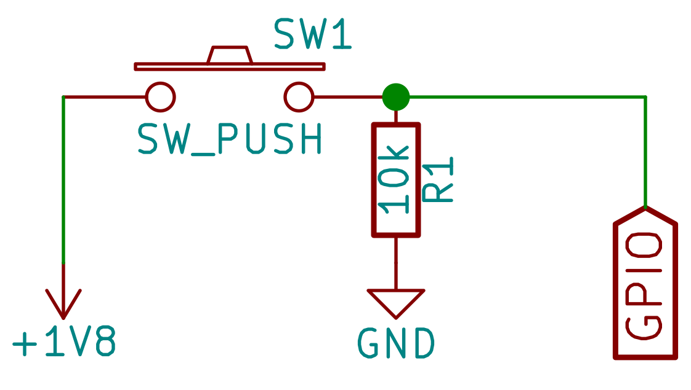

# Intro

The document covers Gapoc A and Gapuino board and peripherals setup. Other GAP8 based boards are not supported yet.

# Gapoc A

## Bill of Materials

- Adafruit 2.8 TFT display with SPI interface
- Push button, 10 kOm resistor and some wires
- Android-based smartphone

## Dip Switches Configuration

|  1  |  2  |  3  |  4  |  5  |  6  |
|-----|-----|-----|-----|-----|-----|
| On  | Off | Off | Off | Off | On  |

## Display Connection

Display module is connected to socket `Conn3` of GAPoc A board with the following scheme:

| Board | Display | Semantic |
|-------|---------|----------|
|   5   |   13    | SCLK     |
|   4   |   12    | MISO     |
|   3   |   11    | MOSI     |
|   6   |   10    | TFT_CS   |
|   2   |    9    | TFT_D/C  |
|   7   |   GND   | GND      |
|   1   |   PWR   | PWR      |

**NOTE** Gapoc A board does not provide 5V pins to power peripherals. 3.3V is used for display power that makes it a bit darker.

## Button Connection

Gapoc A board does not provide spare 3.3v tolerant GPIO pins and 1.8v test pad should be used to power reid-administration mode switch button. Button connection schema:

Gapoc pins:

|    Board    | Semantic |
|-------------|----------|
| Conn3 pin 7 |   GND    |
| Conn3 pin 8 |   GPIO   |
|   1v8 pad   | 1.8v PWR |

**NOTE**: `Conn3` pin 8 has id 25 for `pi_pad_init` call and id 19 for other `pi_gpio_` calls. The hardware setup cold be changed and the pin can ge replaced by any spare GPIO input pin. The ids should be updated accordingly in `setup.h`

# Gapuino

## Build of Materials

- HIGHMAX camera module
- Adafruit 2.8 TFT display with SPI interface

## Display Connection

Display shield is connected to the board directly without extra wires and adapters.
