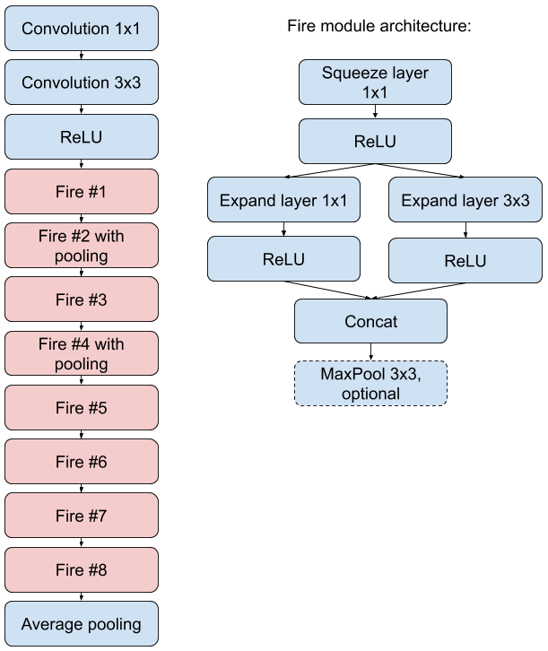
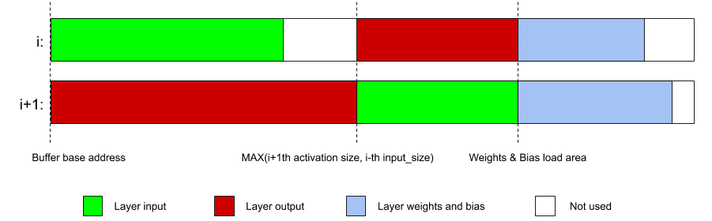
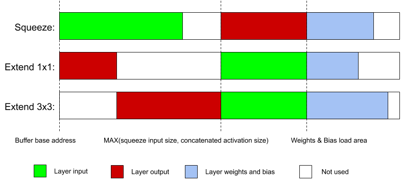

ReID Network Architecture
=========================

Person re-identification by face is done with neural network derived from SqeezeNet 1.1. The network input is 128x128 gray-scale image converted from 8-bit to 16-bit per-pixel depth. Input data normalization is not required. The image contains face only extracted from Face Detector output region and scaled to 128x128. Face detector inherited from Face Detection example returns square regions and face re-size preserves aspect ratio. Original SqeezeNet is designed for RGB images and the entry convolution 1x1 converts image to 3-channel feature map to satisfy the requirement.

The network output is 512 16-bit fixed point vector with face descriptor. Face descriptors are matched with L2 distance. See figure bellow for architecture details.



Memory Map
==========

512 KiB of L2 memory is not enough to store all the weights and activations together with intermediate data. The only way to achieve the goal is to store the weights in external L3 memory and download them to L2 memory before each layer inference. Also, per-layer inference requires layer input, activations, weights and biases stored in L2 during inference. The step to the next layer in the network should produce minimal extra overhead for efficient compute cluster utilization. Input, output and weight buffers should be continuous buffers, and dynamic memory allocation cannot be applied as very limited memory resources are available. The only solution found by authors is static compile-time buffer allocation on top of the continuous memory pool for each layer individually, taking into account the layer output usage on the next steps. This solution requires inference graph analysis and different techniques for different network sub-graphs.

The first sub-graph type in SqueezeNet architecture is a linear chain of layers, where the output of i-th layer is used as an input of i+1-th layer. For this case, chain of two buffers with a floating border is applied. Input and output are allocated starting from the beginning of the memory pool and starting from the floating border. Floating border address is selected to fit the current input of the layer and output of the next layer, to not reallocate already calculated data and achieve continuous memory buffers for free. The piece of memory after the second buffer is used as an area for weight and bias loading from external L3 memory. Border address is calculated by formula and illustrated by figure:

```
    border = max(ActivationSize[i+1], InputSize[i])
```



The second subgraph type is SqueezeNet Fire module. The module consists of squeeze convolution and two expand convolutions that use the squeeze operation output as input. The results of two expand convolutions are concatenated and have to be stored in L2 in continuous buffer during both expand stages. The approach with a floating memory border can be adapted to the Fire module too, but it includes three layers instead of two in the previous case.



The scheme (2) illustrates how to use the left part of the buffer as squeeze input and as a place for concatenation of the expand layers. The right side of the buffer plays the role of the output of squeeze layer and the input for expand layers and cannot be thrown away as intermediate data. The border address is calculated by the formula:

```
    border = max(SqueezeActivationSize[i], Expand1x1ActivationSize[i] + Expand3x3ActivationSize[i])
```

It's important to mention that Fire module is compact in terms of memory, and therefore two sequential Fire modules use base memory pool address as input and don't affect layout of each other.

By using two memory management approaches, we can estimate minimal L2 buffer size needed for per-layer network inference without memory movements and intermediate data swapping with external memory. The maximum amount of memory is consumed by the first two convolutions in the architecture and all Fire modules. Memory consumption statistics can be found in `layers_stat.ods` spreadsheet.
