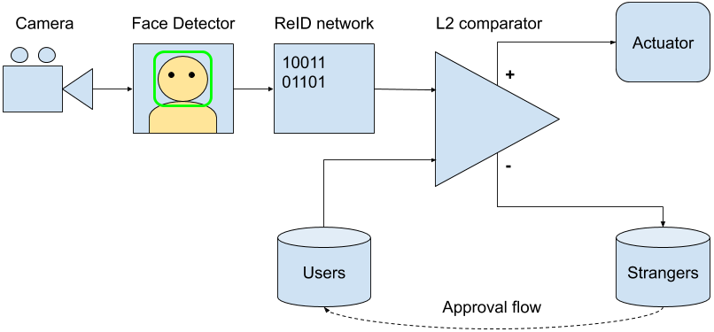

# Overview

The project is aimed to create and deploy a smart doorbell application that would be highly energy-efficient. The main application pipeline consists of 4 stages: frame capture, face detection, face recognition and user interaction e.g. displaying message. In addition to regular face detection and re-identification loop, application provides functionality to add known people to the trusted list using already calculated face descriptors.

GAP SDK already includes a camera driver and an API for still image and video stream capture to L2 memory. The SDK also includes Haar cascade-based face detection demo derived from OpenCV implementation. The authors re-used it in the solution.
Existing face detector provides very good trade-off between performance and quality for the doorbell scenario, since people are standing close to the camera and there is no need in perfect detection of small or distant faces.

# Face Detection

Face Detection step is inherited from Face Detection demo and uses Haar Cascade approach derived from OpenCV implementation with 3-layer pyramid and 25 stages. See Face Detector demo documentation for more technical details. It's important to mention that GAPoc A and GAPuino cameras produce frames with slightly different resolution: 320x240 and 324x244 accordingly. Autotiler model for Face Detection  kernels use different parameters for different boards to cover it.

#Face Preparation for Inference

The detector has 3 layers in pyramid and is capable to return face ROI of 3 typical sizes: 122x122, 154x154, 194x194. For the first case face ROI is augmented with border to adjust neural network input to expected 128x128. For the second and third case re-size kernel is used. The face detector returns square regions and face re-size preserves aspect ratio. The network input is 128x128 gray-scale image converted from 8-bit to 16-bit per-pixel depth. Input data normalization is not required.

# Face Re-Identification

Face descriptor computation is done with SqueezeNet-like neural network. See more in [ReID network architecture and inference details](./network_inference.md)

# Users and Strangers Administration

Depending on board type new users introduction is done on-the-go with PS/2 keyboard on Gapuino and as dedicated step with BLE module and phone on Gapoc A. See [Bluetooth LE protocol for users management](./ble_protocol.md) document for details on board-phone interaction protocol and PS/2 keyboard section for Gapuino in [Hardware configuration and schematics](./hardware.md).

Independently from hardware platform face descriptors with names for all known users are stored in L2 memory as plain arrays. Re-identification is done by minimization of L2 distance between descriptor for current detected face and all faces in users array. The demo compares the distance with `REID_L2_THRESHOLD` threshold to exclude matches with too large distance (strangers).

Gapoc A version of demo uses BLE module for strangers identification and their management is delayed in time. The demo stores face previews for all strangers in L3 memory and descriptors in L2 memory. As soon as the same person is usually detected several times in consequent frames strangers photo deduplication is used. The demo throws away current stranger photo if its L2 distance to one of photos in strangers list is lower than `STRANGER_L2_THRESHOLD`. It's treated as photo of some person who are already seen by the app.
